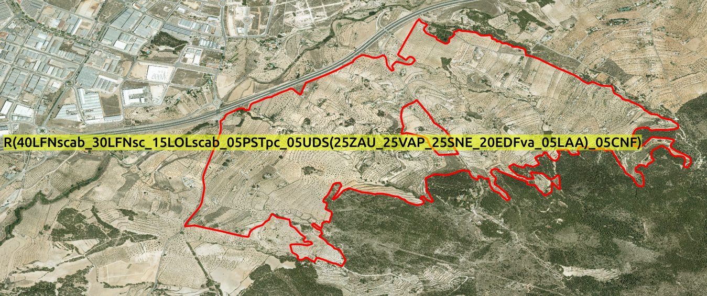
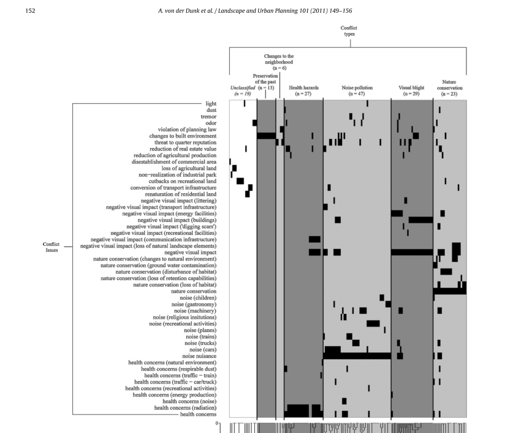
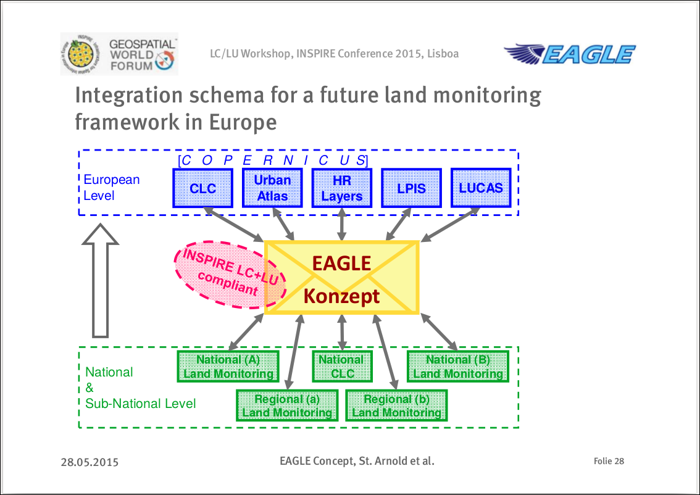

# Proyecto

## Principales atractivos de este proyecto

- Trabajo en equipo con el **IGN** y con el equipo que coordina el SIOSE a nivel nacional
- El SIOSE es una **base de datos geográfica de referencia**
- Superaremos varios **retos tecnológicos** sobre Información Geográfica
- El SIOSE es un **referente a nivel europeo e internacional**
- Participar en algunas líneas de publicación científica de alto impacto (JCR, SCOPUS, etc)
- Abrir **nuevas vías de colaboración y financiación** (H2020, RETOS-COLABORACIÓN, spin-offs, modelos de utilidad, patentes, etc)
- ...

## Equipo investigador

El RETO que abordamos ha de ser llevado a cabo por un equipo de investigación multidisciplinar:

- Sistemas de Información Geográfica
- Bases de datos espaciales
- Minería de Datos, Big Data, Estadística
- Programación y desarrollo
- Geografía Regional y Geografía Humana
- Biogeografía y Ecología
- Estudios del paisaje, climatología y gestión de los recursos hídricos
- ...

## Equipo investigador

](images/team.png)

## Detalles del proyecto

- **Referencia:** CSO2016-79420-R
- **Investigador principal:** Alfredo Ramón Morte
- **Entidad solicitante:** Universidad de Alicante
- **Centro:** Instituto Universitario de Geografía
- **Título:** Innovaciones técnicas y metodológicas en el Sistema de Información sobre Ocupación del Suelo de España (SIOSE) y su aplicación en estudios geográficos.
- **Duración:** 3 años (2017-2020)
- **Costes directos:** 19.000 €
- **Palabras clave:** `usos y coberturas del suelo`, `corine land cover`, `inspire`, `estándares`, `siose`, `modelización orientada a objetos`, `geodatabases`, `nosql`, `medio ambiente`, `sostenibilidad`

## Calendario del proyecto

## Fases, hitos y tareas

1. Fase 1: Creación de un marco de trabajo
    - **Hito 1:** Crear un marco de experimentación reproducible y fácilmente utilizable **por un gran número de usuarios** (aplicación web).
    - **Hito 2:** Analizar las necesidades y rendimiento de distintas tecnologías de bases de datos.

2. Fase 2: Casos de uso
    - **Hito 3:** Desarrollar e implementar un nuevo modelo de datos auxiliar que permita extender las posibilidades de análisis del SIOSE.
    - **Hito 4:** Implementar la transformación del SIOSE a CORINE Land Cover en estas nuevas herramientas.
    - **Hito 5:** Evaluar la **usabilidad** de los datos SIOSE en distintas plataformas tecnológicas, mediante su aplicación en casos de uso reales.

## Página web (pronto será *siose-innova.es*)

# RETO

## ¿Cúal es el RETO principal del proyecto?

1. La base de datos del SIOSE contiene ***Información Geográfica de Referencia***
2. Esta información no es aprovechada al máximo por distintos motivos
3. Nuestro RETO es aumentar la usabilidad del SIOSE y aumentar así el número de usuarios

> **Queremos aprender/enseñar a utilizar el SIOSE. Es una base de datos que modeliza la realidad, no un mapa**

## ¿Que son las brechas de "usabilidad"?
](images/opensdi.png)

## Clasificación vs descripción

## Ejemplo de polígono simple

## Polígonos con 3 coberturas distintas

## Polígonos con coberturas agregadas

## Polígonos más complejos

## Polígonos más complejos

## Primeras estadísticas descriptivas

nº coberturas| totalpolígonos | km2    | % España 
-------------|----------------|--------|----------
           1 |         412021 | 138116 |    15.149
           2 |          13038 |   2484 |     0.272
           3 |         520605 | 203254 |    22.294
           4 |         586959 | 221901 |    24.339
           5 |         397234 | 156628 |    17.180
           6 |         239065 |  92289 |    10.123
           7 |         118741 |  43137 |     4.731
           8 |          68964 |  20389 |     2.236
           9 |          45412 |  13741 |     1.507
          10 |          29678 |   8526 |     0.935
          11 |          18727 |   5058 |     0.555
          12 |          10066 |   2442 |     0.268
          ...|             ...|     ...|     ...
          34 |              1 |      1 |     0.000

## Objetivos

1. **Conocer a los usuarios potenciales**
2. Explorar nuevas tecnologías de bases de datos y modelos que faciliten trabajar con el SIOSE **on-line**
3. Diseñar una aplicación web para acceder al SIOSE de una manera interactiva e **intuitiva**
4. Extender el SIOSE para facilitar su uso en distintas **aplicaciones**
    - Usos del **suelo mixtos** (transporte público, vitalidad urbana, seguridad, espacio/tiempo etc)
    - **Conflictos** de usos del suelo (interfaz urbano-forestal, abandono agrícola, contaminación, etc)
    - Cambios en los usos del suelo (escenarios, evolución, usos históricos, etc)
    - Estimación de los usos del suelo (recursos disponibles, comparación de zonas)

# Líneas de investigación...

## Usabilidad actual del SIOSE

1. Identificar los usuarios potenciales
    - Colegios profesionales (geógrafos, topógrafos, etc)
    - Institutos cartográficos
    - Profesorado SIG e investigadores
    - Ministerios que utilizan SIOSE
    - Empresas y consultoras (p. ej. CARTO)
    - ...

2. Definir una encuesta cualitativa (*likert*) para determinar si los usuarios:
    - Conocen/comprenden el SIOSE
    - Tienen conocimientos sobre bases de datos y modelización
    - ¿Qué saben de INSPIRE y armonización?
    - Aplicaciones potenciales más importantes
    - ...

3. Recopilar respuestas
4. Análisis estadístico de las encuestas (conjunto o por grupos)
5. Discusión

## Usabilidad actual del SIOSE

## Usabilidad actual del SIOSE

## Mixed land uses

## Mixed land uses

## Land use conflicts

## Land use conflicts

## Aspectos técnicos

- Bases de datos NoSQL
- Estadísticas **descriptivas** de los usos del suelo de una zona
- Minería de Datos y Big Data
- Clasificación supervisada por los usuarios
- *Linked data*
- Incorporar nuevos atributos
- ...

# Puesta en marcha

## Reuniones del equipo de investigación

1. Una reunión anual de dos días en la Universidad de Alicante
2. Definir grupos de trabajo:
    - Aplicabilidad del SIOSE (revisión bibliográfica, encuestas, etc)
    - Bases de datos y servicios (publicación, consulta, estadísticas descriptivas, etc)
    - Análisis automático o semiautomático (minería de datos, reclasificaciones)
    - ...

## Seminarios temáticos

Herramientas colaborativas para aumentar la productividad y no duplicar esfuerzos:

- Redacción colaborativa de documentos (dropbox, microsoft online, **google docs**, etc)
- Gestores de tareas (Trello)
- Gestión de bibliografía con **Mendeley** (BibTeX, CSL)
- Análisis automático o semi-automático del SIOSE (herramientas, minería de datos, etc)
- Control de versiones con Git (GitHub, Gitlab, Bitbucket, etc)

Desarrollo del proyecto:

- Modelo de datos del SIOSE (¿En la próxima reunión?)
- Uso de las herramientas desarrolladas

## Gestión de bibliografía con Mendeley

## Gestión de tareas con Trello

## Congresos

Resúmenes aceptados en el Congreso AGE, 25-27 de octubre de 2017 (Madrid):

- "Usos del suelo y evolución del poblamiento vegetal: ensayos con LULC-SIOSE y Helianthemum caput-felis Boiss. en el litoral survalenciano"
- "Investigación reproducible en el contexto del proyecto SIOSE-INNOVA: una propuesta metodológica"

Otros congresos:

1. Congreso TIG AGE 2018 (Valencia)
2. Congreso GISTAM Abril de 2018 (localización por determinar)
3. ...

## Contacto con otros grupos/proyectos

Grupos de interés:

- [EAGLE](http://land.copernicus.eu/eagle/general-information)
- [INSPIRE (LU/LC)](http://inspire.ec.europa.eu/Themes/129/2892)
- [EuroSDR](http://www.eurosdr.net/)
- ...

Proyectos:

- [SIGEOMOD](http://geofireg.ugr.es/sigeomod/pages/presentacion). Proyecto H2020 en la Universidad de Granada.
- ...

## Integración con EAGLE

