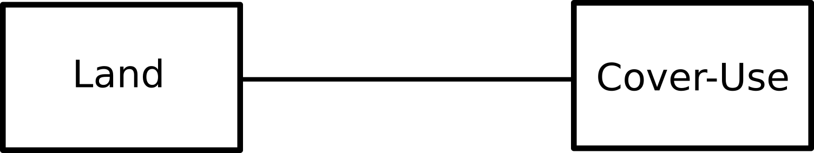
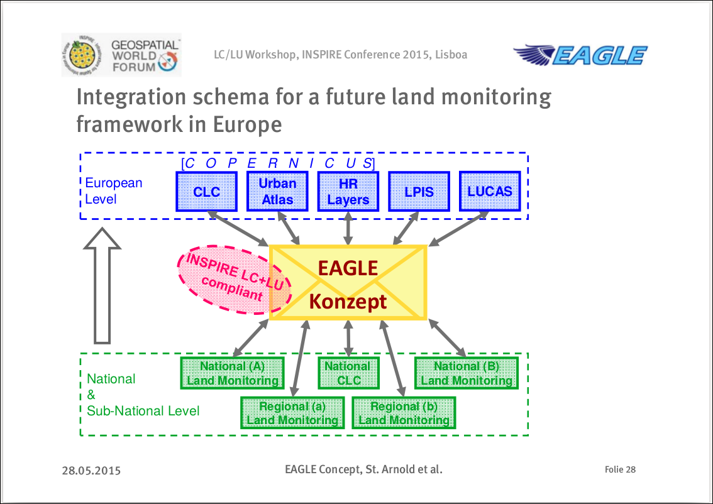
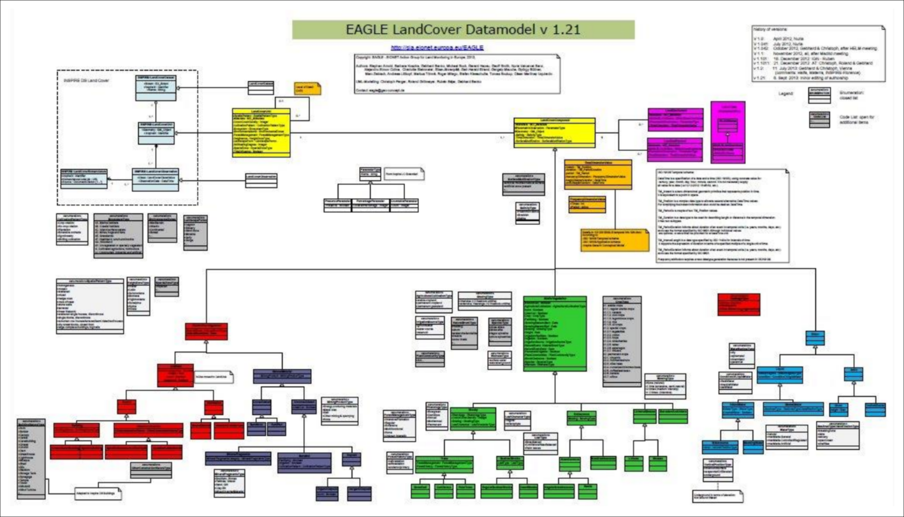
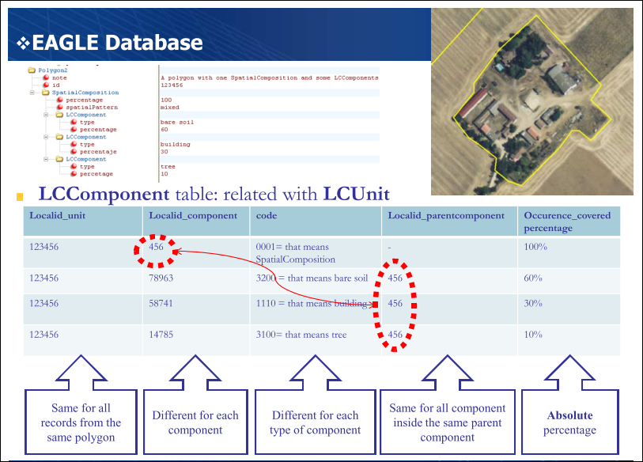

# Act I: Set up the story from the audience’s viewpoint ("A to B, what’s in it for me?")

## Setting (Where am I?)

- **Referencia:** CSO2016-79420-R
- **Investigador principal:** Alfredo Ramón Morte
- **Entidad solicitante:** Universidad de Alicante
- **Centro:** Instituto Universitario de Geografía
- **Título:** Innovaciones técnicas y metodológicas en el Sistema de Información sobre Ocupación del Suelo de España (SIOSE) y su aplicación en estudios geográficos.
- **Duración:** 3 años (2017-2020)
- **Costes directos:** 19.000 €
- **Palabras clave:** `usos y coberturas del suelo`, `corine land cover`, `inspire`, `estándares`, `siose`, `modelización orientada a objetos`, `geodatabases`, `nosql`, `medio ambiente`, `sostenibilidad`

## Role (Who am I here?)

Somos un equipo multidisciplinar compuesto por expertos en:

- Sistemas de Información Geográfica
- Bases de datos espaciales
- Minería de Datos, Big Data, Estadística
- Programación y desarrollo
- Geografía Regional y Geografía Humana
- Biogeografía y Ecología
- Estudios del paisaje, climatología y gestión de los recursos hídricos

## Point A (What challenge do I face?)

> PROBLEMA. Las bases de datos de ocupación del suelo caen en un error que es frecuente entre los cartógrafos que comienzan a utilizar Sistemas de Información Geográfica: utilizan la base de datos para describir un mapa, no para describir la realidad (Villa et al., 2008).

## Usability gaps
](images/opensdi.png)

## Previous considerations about GRD usability
- Modelling geodata from different sources to form one shared, multi-functional data infrastructure (*Bottom-up datawarehouse*)

- Data models for maintenance vs. for distribution of data (*Relational Geodatabases for maintenance and NoSQL for distribution*)

- Modelling geodata for distribution – intelligent structures vs. usability in GIS (*Dual viewing data structures*)

## LU/LC databases in the EU

## LU/LC databases in the EU

## LU/LC databases in the EU

## Call to Action (How do I get from A→B?)

Insertar el calendario del proyecto

## Point B (Where do I want to be?)

- **Conocer a los usuarios potenciales**
- Bases de datos
- Aplicación web interactiva

# Act II: Develop the action ("1-2-3, show me only what I need to see")

## Usabilidad actual del SIOSE
- Identificar los usuarios potenciales
- Definir una encuesta cualitativa 
- Recopilar respuestas
- Análisis 

## Gestión de bases de datos y análisis
- Bases de datos NoSQL
- Estadísticas descriptivas de los usos de una zona
- Árboles de clasificación
- Clasificación supervisada en tiempo real

## Reclasificaciones temáticas 

- Medir el mejor resultado posible en una reclasificación dada
- De SIOSE a CLC
- El SIOSE 

## Zonas de Interfaz Urbano-Forestal

# Act III: Set up the resolution (To be completed in the storyboard phase)

## Reuniones del equipo de investigación
- Definir grupos de trabajo
- Una reunión anual de dos días en la Universidad de Alicante
- Reuniones

## Seminarios temáticos
- Gestión de bibliografía con Mendeley (BibTeX, CSL)
- Redacción colaborativa de documentos
- Modelo de datos del SIOSE
- Uso de las herramientas desarrolladas

## Congresos y eventos

Congreso AGE en Madrid:

- Helianthemum
- Reproducibilidad

¿Otras propuestas?

