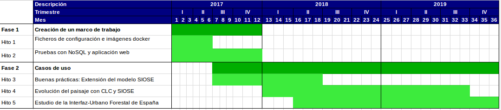

# Proyecto

## Principales atractivos de este proyecto

- Trabajar en equipo con el **IGN** y con el equipo que coordina el SIOSE a nivel nacional
- Facilitar el acceso de la sociedad a una **base de datos geográfica de referencia**
- Superar varios **retos tecnológicos** sobre Información Geográfica
- El SIOSE y los problemas que estudiaremos son **referentes a nivel europeo e internacional**
- Participar en algunas líneas de publicación científica de alto impacto (JCR, SCOPUS, etc)
- Abrir **nuevas vías de colaboración y financiación** (H2020, RETOS-COLABORACIÓN, Spin Offs, modelos de utilidad, patentes, etc)
- ...

## Equipo investigador

El RETO que abordamos ha de ser llevado a cabo por un equipo de investigación multidisciplinar:

- Sistemas de Información Geográfica
- Bases de datos espaciales
- Minería de Datos, Big Data, Estadística
- Programación y desarrollo
- Geografía Regional y Geografía Humana
- Biogeografía y Ecología
- Estudios del paisaje, climatología y gestión de los recursos hídricos
- ...

## Equipo investigador

](images/team.png)

## Detalles del proyecto

- **Referencia:** CSO2016-79420-R
- **Investigador principal:** Alfredo Ramón Morte
- **Entidad solicitante:** Universidad de Alicante
- **Centro:** Instituto Universitario de Geografía
- **Título:** Innovaciones técnicas y metodológicas en el Sistema de Información sobre Ocupación del Suelo de España (SIOSE) y su aplicación en estudios geográficos.
- **Duración:** 3 años (2017-2020)
- **Costes directos:** 19.000 €
- **Palabras clave:** `usos y coberturas del suelo`, `corine land cover`, `inspire`, `estándares`, `siose`, `modelización orientada a objetos`, `geodatabases`, `nosql`, `medio ambiente`, `sostenibilidad`

## Calendario del proyecto

## Fases, hitos y tareas

1. Fase 1: Creación de un Marco de trabajo
    - **Hito 1:** Crear un marco de experimentación reproducible y fácilmente utilizable por un gran número de usuarios (aplicación web).
    - **Hito 2:** Analizar las necesidades y rendimiento de distintas tecnologías de bases de datos.

2. Fase 2: Casos de uso
    - **Hito 3:** Desarrollar e implementar un nuevo modelo de datos auxiliar que permita extender las posibilidades de análisis del SIOSE.
    - **Hito 4:** Implementar la transformación del SIOSE a CORINE Land Cover en estas nuevas herramientas.
    - **Hito 5:** Evaluar la **usabilidad** de los datos SIOSE en distintas plataformas tecnológicas, mediante su aplicación en casos de uso reales.

# RETO

## ¿Cúal es el RETO principal del proyecto?

1. La base de datos del SIOSE contiene ***Información Geográfica de Referencia***
2. Esta información no es aprovechada al máximo por distintos motivos
3. Nuestro RETO es aumentar la usabilidad del SIOSE y aumentar así el número de usuarios

> **Queremos aprender/enseñar a utilizar el SIOSE. Es una base de datos que modeliza la realidad, no un mapa**

## Clasificación vs descripción

Insertar figura SIOSE

## Riqueza descriptiva del SIOSE

Figuras siose clasificado y datos descriptivos

## ¿Que son las brechas de "usabilidad"?
](images/opensdi.png)

## Objetivos

- **Conocer a los usuarios potenciales**
- Explorar nuevas tecnologías de bases de datos y modelos que faciliten trabajar con el SIOSE **on-line**
- Diseñar una aplicación web interactiva e intuitiva
- Extender el SIOSE para facilitar su uso en distintas aplicaciones
    - Usos del suelo mixtos
    - Conflictos de usos del suelo
    - Intensidad
    - 

## Usabilidad actual del SIOSE

- Identificar los usuarios potenciales
    - Colegios profesionales y otros colectivos
    - Investigadores
    - Profesorado

- Definir una encuesta cualitativa para determinar si los usuarios:
    - Conocen/comprenden el SIOSE
    - Manifiestan alguna opinión
    - Bases de datos y modelización
    - INSPIRE y armonización
    - Aplicaciones potenciales más importantes

- Recopilar respuestas
- Análisis estadístico de las encuestas (conjunto o por grupos)
- Discusión

## Gestión de bases de datos y análisis

- Bases de datos NoSQL
- Estadísticas descriptivas de los usos del suelo de una zona
- Árboles de clasificación
- Clasificación supervisada en tiempo real
- *Linked data*

## Reclasificaciones temáticas 

- Medir el mejor resultado posible en una reclasificación dada
- De SIOSE a CLC
- El SIOSE

# Puesta en marcha

## Reuniones del equipo de investigación
- Una reunión anual de dos días en la Universidad de Alicante
- Definir grupos de trabajo:
    - Aplicabilidad del SIOSE (revisión bibliográfica, encuestas, etc)
    - Bases de datos y servicios (publicación, consulta, estadísticas descriptivas, etc)
    - Análisis automático o semiautomático (minería de datos, reclasificaciones)

## Seminarios temáticos

Herramientas colaborativas para aumentar la productividad, no duplicar esfuerzos:

- Gestión de bibliografía con Mendeley (BibTeX, CSL)
- Redacción colaborativa de documentos (dropbox, microsoft online, google docs, etc)
- Análisis automático o semi-automático del SIOSE (herramientas, minería de datos, etc)
- Control de versiones con Git (GitHub, Gitlab, Bitbucket, etc)
- Gestores de tareas (Trello)

Desarrollo del proyecto:

- Modelo de datos del SIOSE (¿En la próxima reunión?)
- Uso de las herramientas desarrolladas

## Congresos

1. Congreso AGE 2017 (Madrid). Resúmenes aceptados:
  - "Usos del suelo y evolución del poblamiento vegetal: ensayos con LULC-SIOSE y Helianthemum caput-felis Boiss. en el litoral survalenciano"
  - "Investigación reproducible en el contexto del proyecto SIOSE-INNOVA: una propuesta metodológica"
2. Congreso TIG AGE 2018 (Valencia)
3. Congreso GISTAM 2018
4. ...

## Contacto con otros grupos/proyectos

1. EAGLE
2. INSPIRE
3. etc
